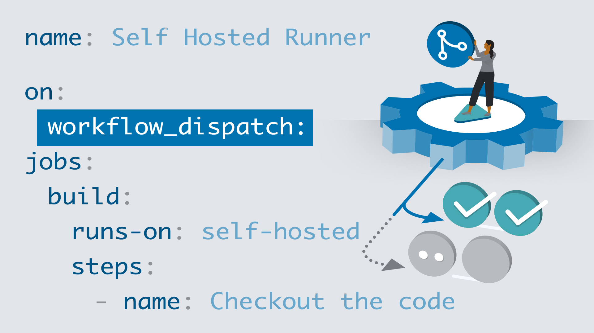

# GitHub Actions Courses
LinkedIn Learning has other classes on GitHub Actions!

## Learning GitHub Actions

[Link to the course page](https://www.linkedin.com/learning/learning-github-actions-2/automating-with-github-actions-2)

Lorem ipsum dolor sit amet, consectetur adipiscing elit, sed do eiusmod tempor incididunt ut labore et dolore magna aliqua. Urna neque viverra justo nec ultrices dui sapien. Facilisis volutpat est velit egestas dui id ornare arcu odio. Justo donec enim diam vulputate. Mauris rhoncus aenean vel elit scelerisque mauris. Magna etiam tempor orci eu lobortis elementum. Pharetra pharetra massa massa ultricies mi quis. Integer feugiat scelerisque varius morbi enim nunc faucibus a. Neque egestas congue quisque egestas diam in. Hendrerit dolor magna eget est lorem ipsum. Fusce ut placerat orci nulla pellentesque dignissim enim sit. Erat imperdiet sed euismod nisi porta lorem mollis aliquam.

## Advanced GitHub Actions

[Link to the course page](https://www.linkedin.com/learning/advanced-github-actions/next-level-github-actions)

Lacus sed turpis tincidunt id aliquet risus. Diam maecenas ultricies mi eget mauris pharetra et. Facilisis leo vel fringilla est ullamcorper eget. Imperdiet dui accumsan sit amet nulla facilisi morbi. Nunc aliquet bibendum enim facilisis gravida neque convallis a cras. Id diam vel quam elementum. Vitae turpis massa sed elementum tempus egestas sed. Est ultricies integer quis auctor elit sed vulputate mi sit. Eget mauris pharetra et ultrices neque. Quam nulla porttitor massa id. Donec adipiscing tristique risus nec feugiat in fermentum posuere urna. Tincidunt vitae semper quis lectus nulla at volutpat. Faucibus turpis in eu mi bibendum. Cras ornare arcu dui vivamus arcu. Cursus eget nunc scelerisque viverra mauris in aliquam sem. At erat pellentesque adipiscing commodo elit at imperdiet dui.

